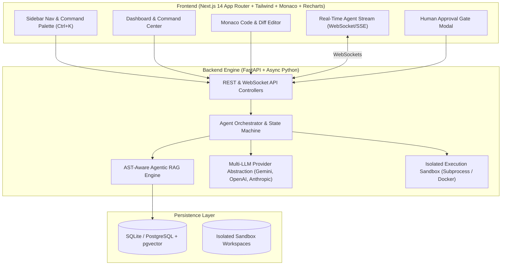

# DevPilot AI — Autonomous AI Engineering Command Center

DevPilot AI is a production-quality autonomous AI engineering platform designed for software development teams to investigate bugs, explore codebases, generate AST-aware implementations, run pytest/npm test suites in an isolated sandbox, perform security audits, track incident telemetry, generate documentation, and create GitHub Pull Requests under human-in-the-loop oversight.

---

## 🌟 Key Capabilities

- **Autonomous Agent Orchestrator & State Machine**: Explicit state transitions across `PLANNING`, `INVESTIGATING`, `SEARCHING`, `CODING`, `TESTING`, `DEBUGGING`, `SECURITY_CHECK`, `REVIEWING`, `WAITING_FOR_APPROVAL`, `COMPLETED`, and `FAILED`.
- **AST-Aware Agentic RAG**: Language-specific structural code chunking (Python AST & JS/TS Regex Parser) with hybrid cosine similarity, symbol boosting, and path reranking.
- **Isolated Subprocess Execution Sandbox**: Executes test suites (`pytest`, `npm test`) inside temporary workspace clones with execution timeout, stdout/stderr capture, exit code reporting, and environment isolation.
- **Human Approval Gate & Diff Review**: Prevents unauthorized production actions or automatic git pushes by generating PR preview diffs for human signoff.
- **Multi-LLM Provider Layer**: Unified abstraction supporting **Google Gemini 2.5**, **OpenAI GPT-4o**, and **Anthropic Claude 3.5 Sonnet**.
- **Real-Time Streaming Telemetry**: WebSocket and SSE stream agent trajectories, token usage, execution time, and cost analytics.
- **Demo Mode**: Safe pre-seeded demo microservice repository with real failing tests, security vulnerabilities, and session persistence bugs for instant evaluation.

---

## 🏗 System Architecture



---

## 🚀 Quick Start Guide

### 1. Backend Setup

```bash
cd backend
python -m venv venv

# Windows PowerShell
.\venv\Scripts\activate

# Install dependencies
pip install -r requirements.txt

# Start FastAPI server
uvicorn main:app --reload --port 8000
```

FastAPI server starts at `http://localhost:8000`. OpenAPI documentation available at `http://localhost:8000/docs`.

### 2. Run Backend Tests

```bash
cd backend
.\venv\Scripts\pytest tests/test_api.py
```

### 3. Frontend Setup

```bash
cd frontend

# Install Node dependencies
npm install

# Start Next.js development server
npm run dev
```

Next.js Command Center starts at `http://localhost:3000`.

---

## 🛠 Tech Stack Summary

- **Frontend**: Next.js 14 (App Router), TypeScript, Tailwind CSS, Monaco Editor (`@monaco-editor/react`), Lucide React icons, Recharts, Framer Motion.
- **Backend**: FastAPI, Python 3.13, SQLAlchemy 2.0 (Async), Pydantic v2, PyJWT, Passlib, pytest, WebSockets.
- **Database**: SQLite (Async with JSON vector support) / PostgreSQL + pgvector.
- **Sandbox**: Subprocess workspace runner with process isolation and timeout enforcement.
- **AI Integration**: Multi-provider LLM abstraction (Google Gemini, OpenAI, Anthropic).

---

## 📝 License

Distributed under the MIT License. Developed for software engineering teams and autonomous AI research.
